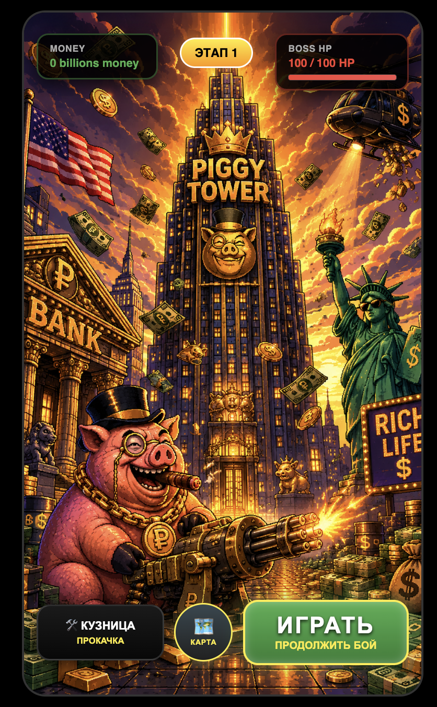
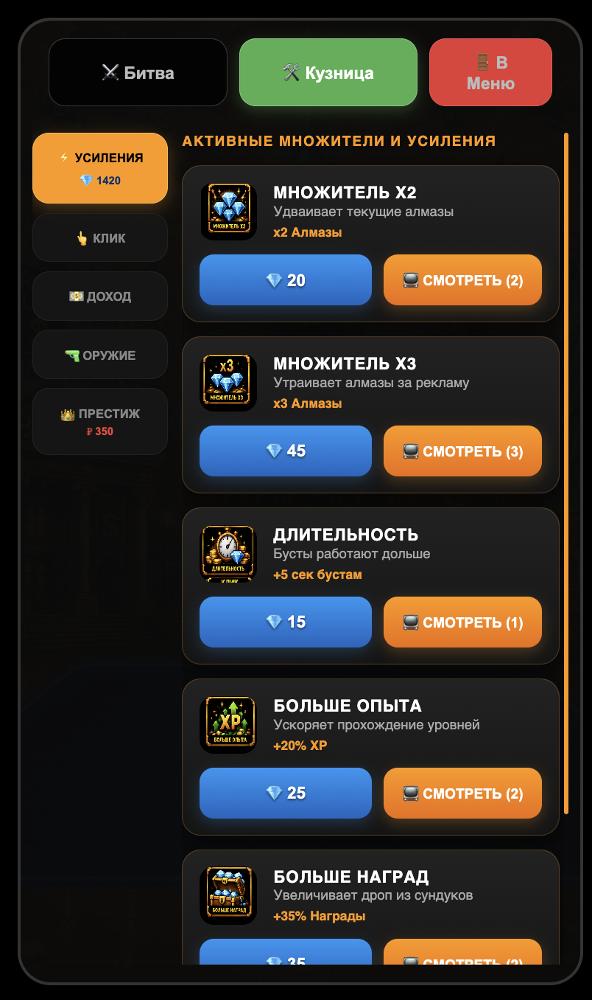
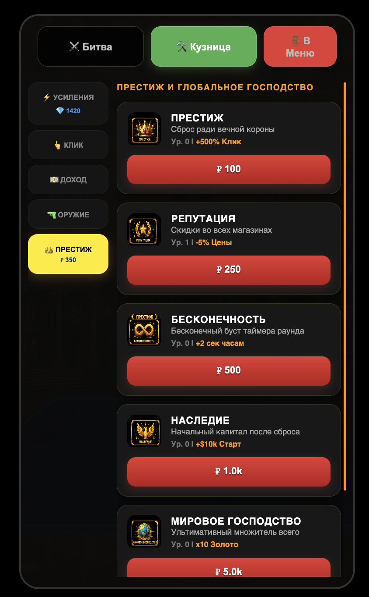
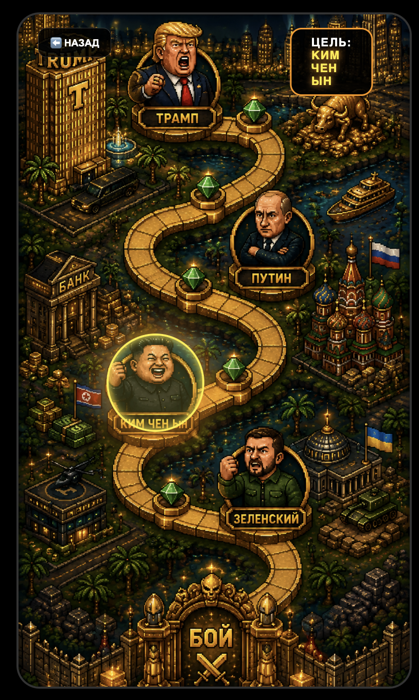
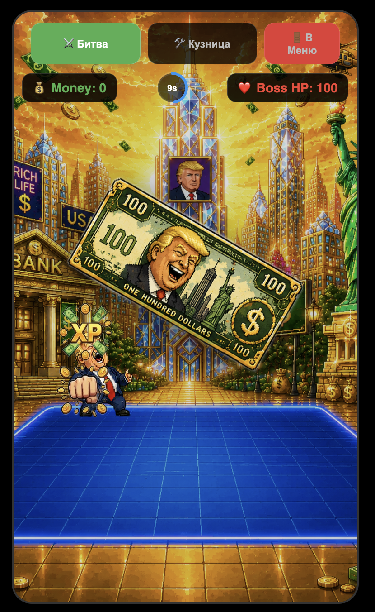
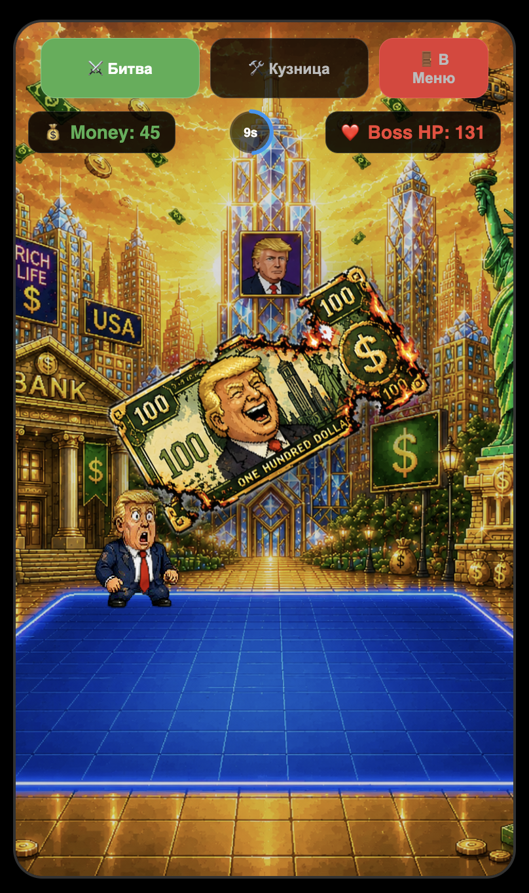
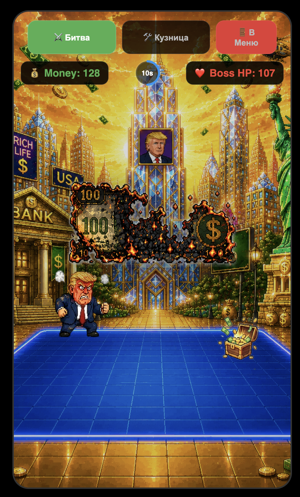
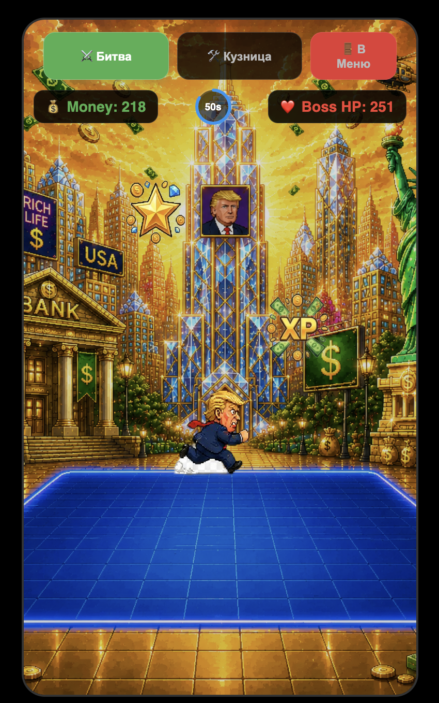
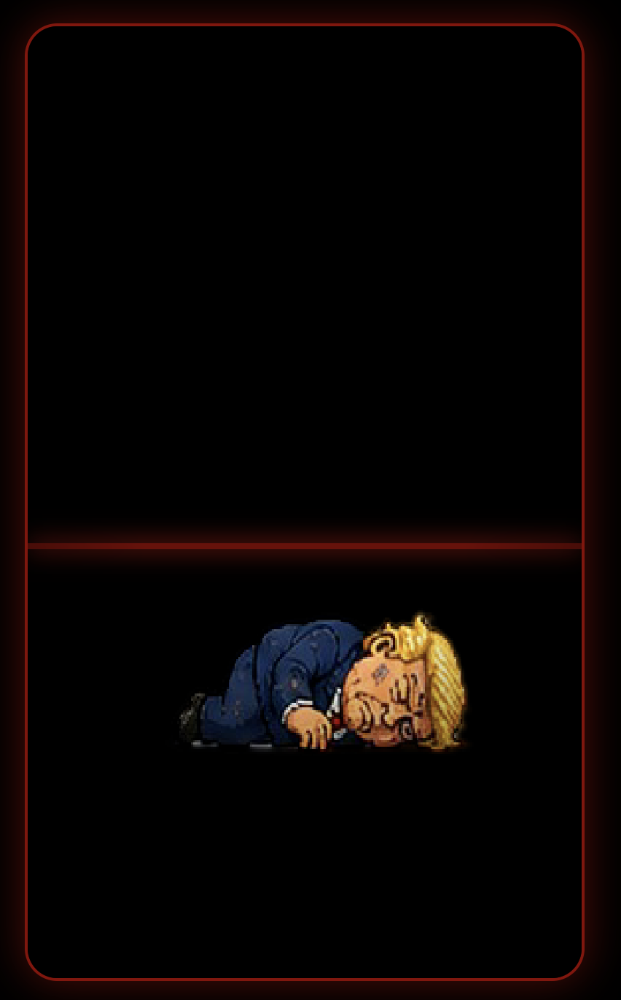

# 💰 Mr Money Clicker Game

> **Premium Incremental Clicker Game** — высокопроизводительный мобильный кликер с глубокой системой мета-прокачки, интерактивной глобальной картой и динамической симуляцией экономики. Разработано на базе компонентного подхода Vue 3, Vite и TypeScript.

---

## 📸 Галерея интерфейса (Screenshots)

<table width="100%">
  <tr>
    <td width="33.3%" align="center">
      <b>🎮 Главное лобби</b><br><br>
      
    </td>
    <td width="33.3%" align="center">
      <b>🛠️ Кузница (Магазин)</b><br><br>
      
      
    </td>
    <td width="33.3%" align="center">
      <b>🗺️ Карта кампании</b><br><br>
      
    </td>
    <td width="33.3%" align="center">
      <b>🗺️ Карта кампании</b><br><br>
      
    </td>
    <td width="33.3%" align="center">
      <b>🗺️ Карта кампании</b><br><br>
      
    </td>
    <td width="33.3%" align="center">
      <b>🗺️ Карта кампании</b><br><br>
      
    </td>
    <td width="33.3%" align="center">
      <b>🗺️ Карта кампании</b><br><br>
      
    </td>
    <td width="33.3%" align="center">
      <b>🗺️ Карта кампании</b><br><br>
      
    </td>
  </tr>
</table>


---

## ⚡ Ключевые особенности и механики

*   **🕹️ Arcade Machine Form-Factor** — интерфейс жестко инкапсулирован в строго вертикальный контейнер `480x820px` с адаптивным масштабированием под мобильные экраны (Pixel-Perfect UI).
*   **🗺️ Интерактивная Карта Кампании** — полностью кастомный экран выбора боссов (Трамп, Путин, Ким Чен Ын, Зеленский). Реализована динамическая подмена мета-данных и пула здоровья (HP) врага на лету при клике на ворота «БОЙ».
*   **🛠️ Модульная Кузница (Магазин улучшений)** — 25 уникальных игровых абилок, разделенных на 5 категорий (*Усиления, Клик, Доход, Оружие, Престиж*).
*   **🎨 Оптимизация графики (CSS Спрайты)** — все 25 иконок Кузницы ювелирно нарезаются из единого текстурного атласа (`shop-spritesheet.png`) через динамический сдвиг координат `background-position`. Это сводит количество HTTP-запросов к единице и исключает мерцание интерфейса.
*   **📺 Монетизация & Reward Ads** — интеграция альтернативной стоимости товаров. Игрок может активировать премиальные бусты бесплатно, запустив интерактивную симуляцию просмотра рекламных роликов.

---

## 🛠️ Архитектура и Стек технологий

Проект спроектирован с учетом лучших практик построения клиентских приложений:

*   **Фреймворк:** [Vue 3](https://vuejs.org) (Composition API, Архитектура `<script setup>`).
*   **Сборщик и окружение:** [Vite](https://vitejs.dev) (сверхбыстрая HMR-компиляция и оптимизация ассетов).
*   **Строгая типизация:** [TypeScript](https://typescriptlang.org) (Runtime Props, кастомные интерфейсы данных `ShopItem`, `IBoss`, полное исключение ошибок компиляции).
*   **Шина событий (Event Bus):** Реализован паттерн *Singleton* для глобального обмена событиями и реактивного управления стейтом между независимыми модулями (например, синхронизация покупки в магазине с уроном в бою).
*   **Менеджеры систем (Service Registry):** Изолированная бизнес-логика (`BossManager`, `MoneyManager`), отделенная от слоя отображения (шаблонов Vue).

---

## 🚀 Быстрый старт (Развертывание локально)

1. Клонировать репозиторий:
   ```bash
   git clone https://github.com
   ```
2. Перейти в папку с проектом:
   ```bash
   cd money-clicker-game
   ```
3. Установить все зависимости пакета:
   ```bash
   npm install
   ```
4. Запустить локальный сервер для разработки:
   ```bash
   npm run dev
   ```
5. Собрать оптимизированный Production-билд:
   ```bash
   npm run build
   ```

---

## 🔐 Лицензия

**All Rights Reserved (Все права защищены) © 2026 mrbread**

Исходный код и медиа-ассеты (графика, спрайт-листы, UI-элементы) защищены авторским правом. Данный репозиторий открыт **исключительно для ознакомления, код-ревью и образовательных целей**. Любое несанкционированное копирование, модификация, создание форков с целью дистрибуции или коммерческое использование материалов без письменного согласия автора **строго запрещено**.
